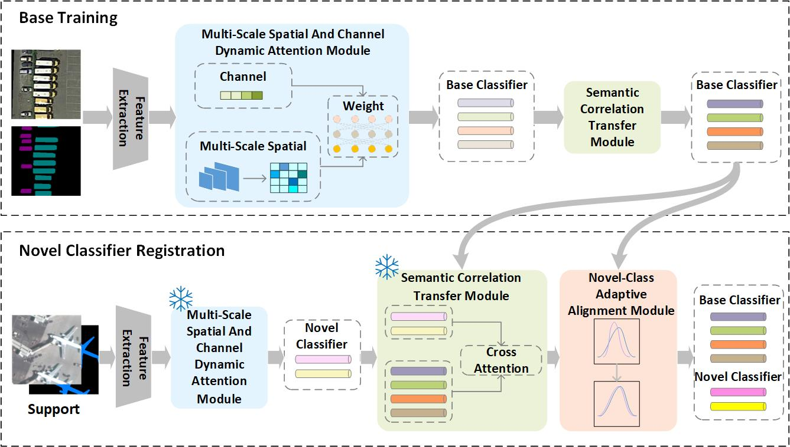

# BKTNet
## Usage
+ For training, please set the option **only_evaluate** to **False** in the configuration file. Then execute this command at the root directory: 

    sh train.sh {*dataset*} {*model_config*}
    
+ For evaluation only, please set the option **only_evaluate** to **True** in the corresponding configuration file. 

## Figs

## Datasets
iSAID:

https://captain-whu.github.io/iSAID/index.html

## Environments
1. Python 3.8
2. PyTorch 1.7.0
3. cuda 11.0
4. torchvision 0.8.1
5. tensorboardX 2.14
